# 🏦 Resurrection Finance - Event-Driven Banking System

> 🇪🇸 [**Leer versión en Español**](./README.es.md)

A secure and scalable **banking backend** built with Java 21 and Spring Boot, designed using a **distributed event-driven architecture**.

This system handles users, accounts and transactions while guaranteeing **data consistency, fault tolerance and real-time updates** through Apache Kafka and WebSockets.

## 💡 Purpose

Traditional banking systems tightly couple transaction processing with notifications.

This project solves that by:

* ⚡ Decoupling core logic from real-time communication.
* 🔁 Ensuring **eventual consistency** across services.
* 📦 Preventing data loss using the **Transactional Outbox Pattern**.
* 📡 Delivering real-time updates via WebSockets.

## 🚀 Tech Stack
*   **Java 21** & **Spring Boot**
*   **Spring Security** (JWT & BCrypt)
*   **PostgreSQL** (Managed with Docker & Docker Compose)
*   **Hibernate / JPA** (Data persistence & relations)
*   **Apache Kafka** (Distributed Event Streaming & Outbox Pattern)
*   **Spring WebSockets (STOMP)** (Real-time Telemetry & Instant Notifications)
*   **Swagger / OpenAPI 3** (Interactive documentation)
*   **JUnit 5 & Mockito** (Unit Testing for core logic)
*   **Lombok** (Boilerplate reduction)

## 🛡️ Key Features

### 🔐 Security
* JWT Authentication
* Role-Based Access Control (ADMIN / USER)
* Resource ownership validation

### 💸 Transactions
* Atomic transfers using `BigDecimal`
* Validation (no self-transfer, sufficient balance)
* Transaction history with pagination

### 📡 Event-Driven Architecture
* Transactional Outbox Pattern
* Reliable event publishing to Kafka
* Retry mechanism for failed deliveries

### ⚡ Real-Time Updates
* Balance updates via WebSockets
* Live transaction notifications
* Event-driven UI synchronization

### 🧾 Data Integrity
* Immutable transaction records
* Soft delete for users (no historical data loss)

### 👑 Admin Panel
* User management (active/inactive)
* Soft delete & reactivation
* Filtering and search

## 🧠 Architecture Overview

This system is composed of two services:

### 🏛️ Core Banking API (this repository)
* Handles users, accounts and transactions.
* Persists events using the **Transactional Outbox Pattern**.
* Publishes events to Kafka.

### 📡 Messenger Service
👉 https://github.com/marcoslabourdette/resurrection-messenger-kafka

* Consumes Kafka events
* Persists notification snapshots
* Broadcasts real-time updates via WebSockets

## 🧱 System Architecture

User Action (Transfer)
|
v
+----------------------+
| Banking API |
| (Transaction + DB) |
+----------+-----------+
|
v
Outbox Table (DB)
|
v
Outbox Processor
|
v
Kafka Topic
|
v
+----------------------+
| Messenger Service |
| (Consumer + WS) |
+----------+-----------+
|
v
Real-Time UI Update

## 🛰️ Event Reliability (Outbox Pattern)

Resurrection Finance utilizes a **Distributed Architecture** to ensure scalability and data integrity.

### 🏛️ Transactional Outbox Pattern
To prevent data loss between the **Core Banking API (8080)** and the **Messenger Service (8081)**, we implemented the Outbox Pattern:
1. **Atomic Persistence**: Transactions and events are stored in a single atomic database commit in PostgreSQL.
2. **Event Dispatcher**: An internal worker monitors the `outbox` table and publishes events to **Apache Kafka**.
3. **Real-time Delivery**: The Messenger Service consumes Kafka topics and broadcasts alerts to the pilot's dashboard via **WebSockets**.
4. **Failed events** are retried automatically.

This ensures:
* No event loss
* Strong consistency
* Fault tolerance when Kafka is unavailable

## 🛠️ Installation & Setup

1.  **Clone the repository:**
    ```bash
    git clone https://github.com/marcoslabourdette/resurrection-finance-api
    cd resurrection-finance
    ```
2.  **Environment Variables:**
    Copy the example file and set your keys:
    ```bash
    cp .env.example .env
    ```
3.  **Run with Docker:**
    ```bash
    docker-compose up -d
    ```
4.  **Access the Infrastructure:**
    * **Swagger UI (Core API)**: [http://localhost:8080/swagger-ui/index.html](http://localhost:8080/swagger-ui/index.html) to test the API.
    * **Kafka UI (Event Telemetry)**: [http://localhost:8082](http://localhost:8082) - To monitor topics, messages, and consumer groups in real-time.

## 🧪 Testing
Run the unit tests to verify the core transaction logic:

```bash
mvn test
```  

## 📸 Screenshots

### 🔑 Secure Onboarding & Authentication Flow
Resurrection Finance features a robust, multi-layer validated onboarding process designed for global scalability. The system ensures data integrity through immediate service synchronization.

#### 🏛️ Step 1: Partner Registration
The registration interface provides real-time field validation and bicultural support (ES/EN). Upon submission, the system executes an atomic transaction to persist user credentials and initialize the financial profile.
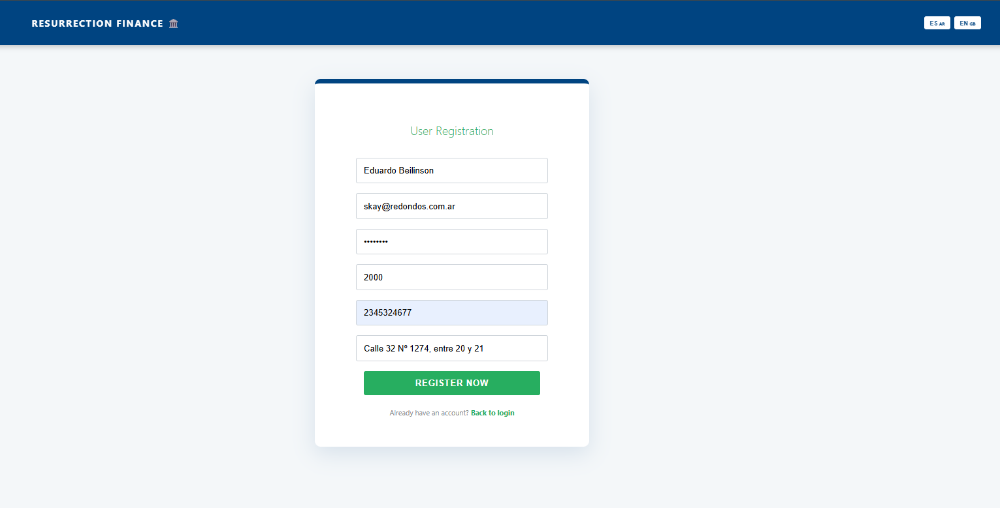

#### 🏛️ Step 2: Service Synchronization & Instant Granting
Following successful persistence, the **Transactional Outbox Pattern** ensures the dispatch of a 'User Created' event via **Apache Kafka**. The Messenger Service consumes this event, triggering an automated welcome bonus and real-time notification delivery through **WebSockets**.
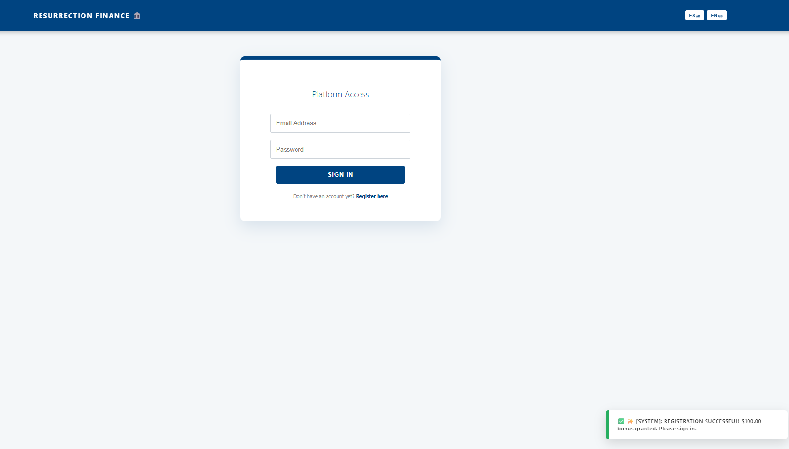


### 🏛️ User Dashboard (Real-Time Interface)
The main command center for socios, featuring real-time balance updates, bicultural support (ES/EN), and synchronized transaction history.

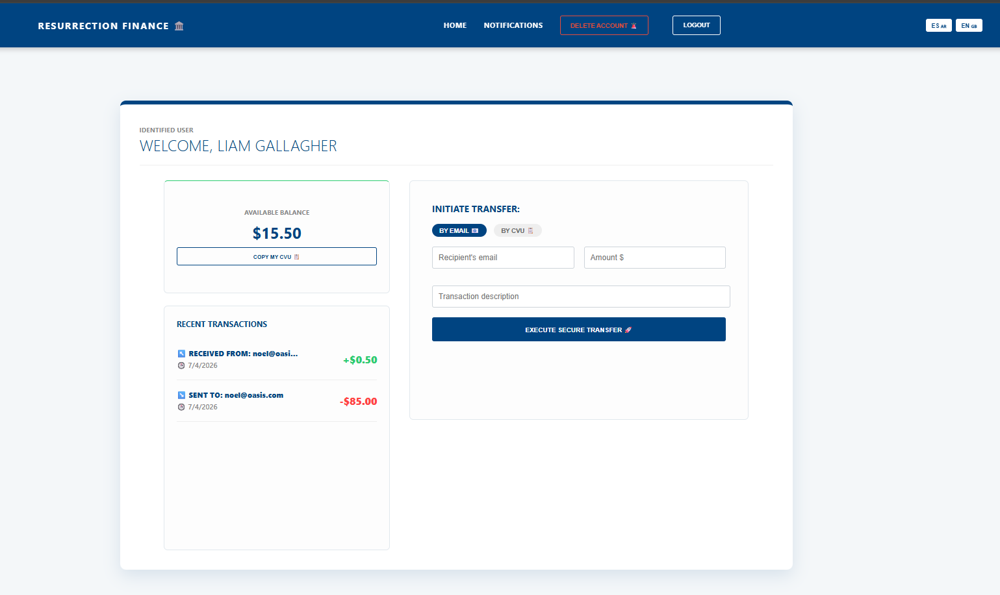


### 👑 Administrative Command Center (RBAC & Data Integrity)
Full administrative control panel demonstrating **Role-Based Access Control**. 
Features real-time partner monitoring, soft-delete anonymization for GDPR compliance, and instant reactivation protocols. 

Notice the **Soft-Delete** implementation: historical data remains intact while personal identity is protected according to international security standards.

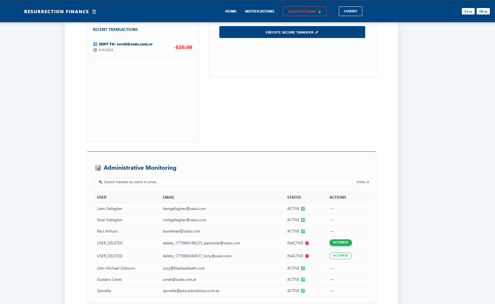


### 🛰️ Real-Time Telemetry & Messenger Integration
The **Event-Driven Architecture** in action: Instant notifications received via WebSockets after Kafka processing.

This service is managed by the independent microservice: 
👉 [**Resurrection Messenger (Kafka Consumer)**](https://github.com/marcoslabourdette/resurrection-messenger-kafka)

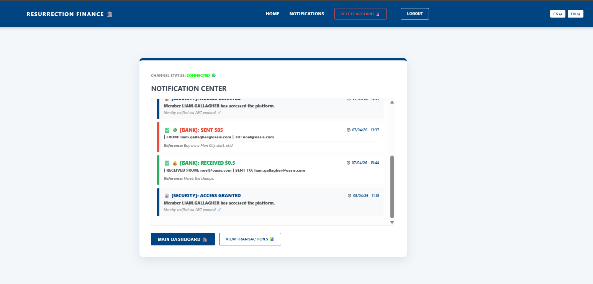


### 🛠️ API Documentation (Swagger UI)
Interactive documentation with secure endpoints and JWT Authorization.


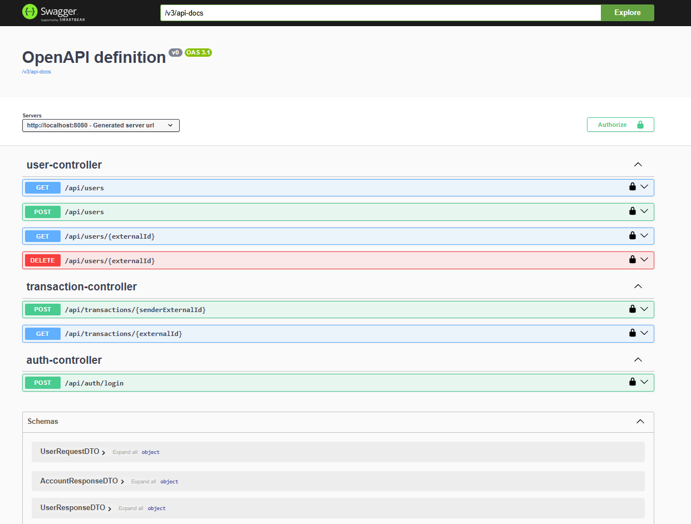


### 🔑 Authentication (JWT Token)
Login process generating a secure Bearer Token for Liam Gallagher.


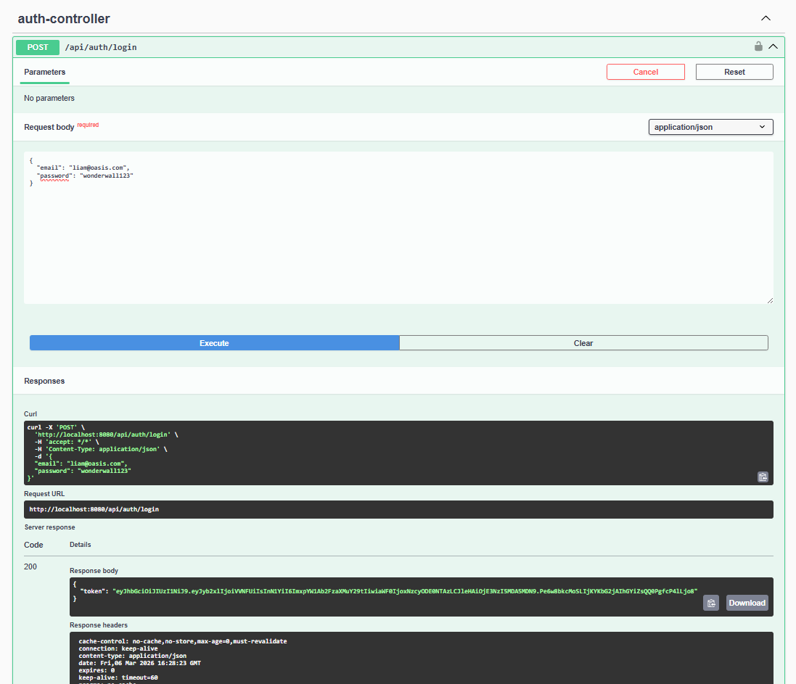


### 🛡️ Resource Ownership Validation
Demonstration of the system blocking an authenticated user from accessing another user's private transaction history (403 Forbidden).


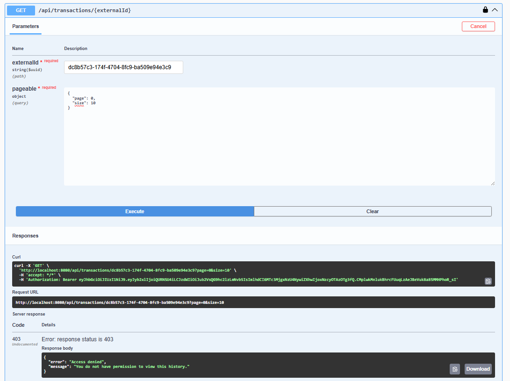


### 👮‍♂️ Security (Access Control)
Proof of RBAC (Role-Based Access Control) blocking unauthorized users.


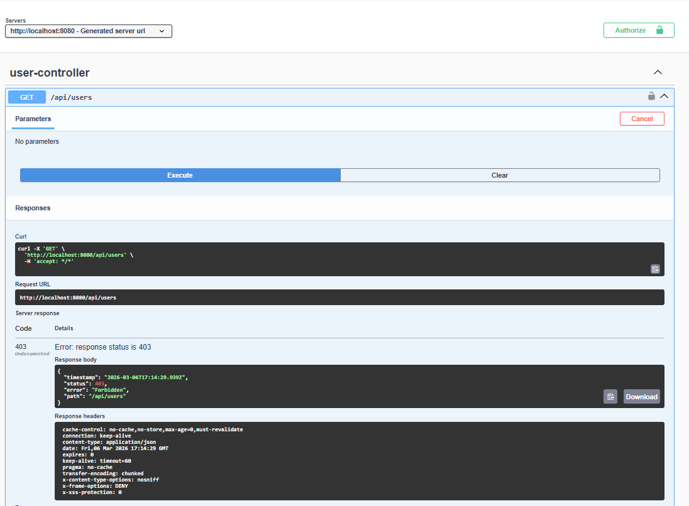


### 👑 Admin Access (Full User List)
Proof of administrative privileges allowing access to the complete user database.


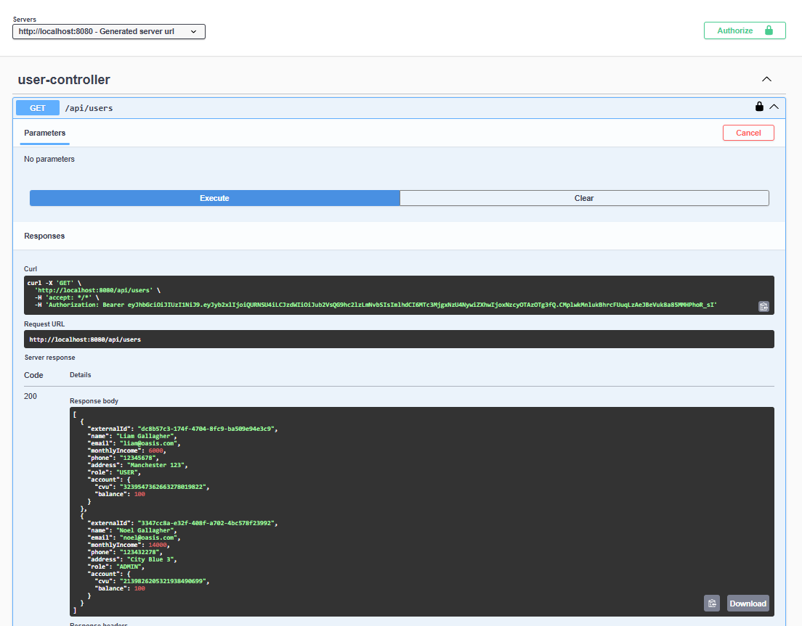


### 📊 Scalable History (Pagination)
Transaction history with full pagination metadata (Page, Size, Total Elements).


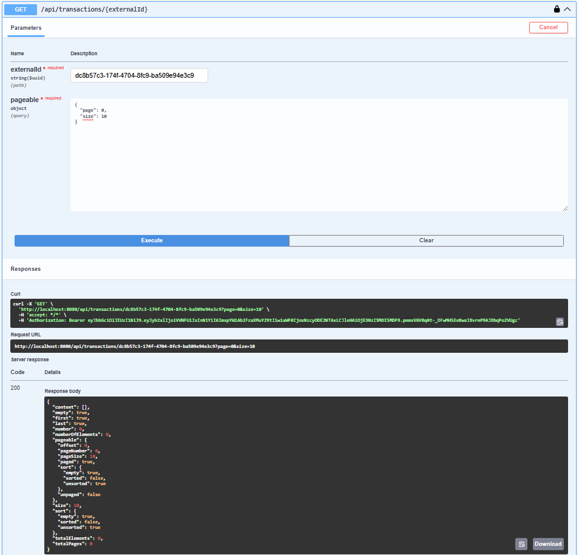


### 🧪 Unit Testing
Validation of core business logic using JUnit 5 and Mockito.


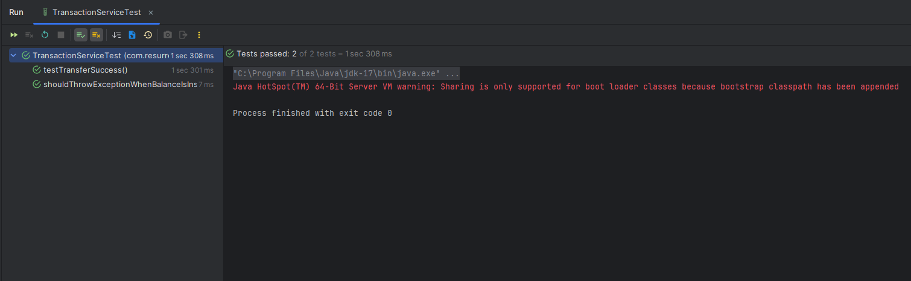
